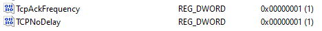
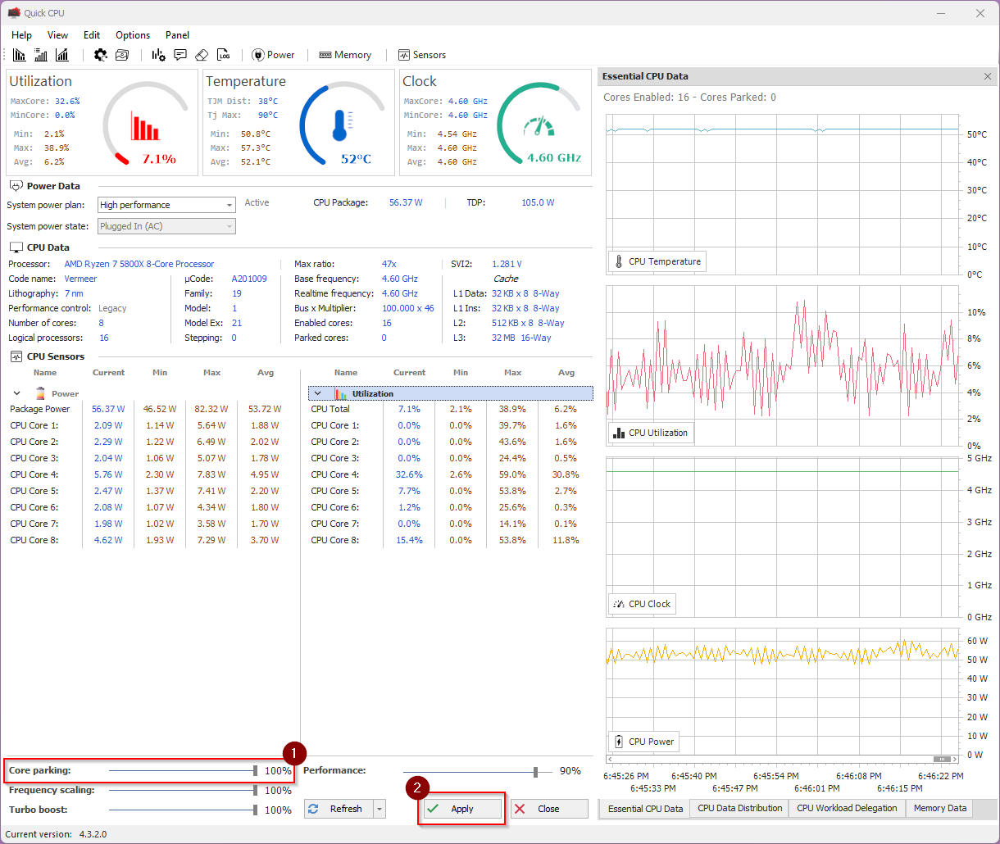

# PS2 Settings and PC Optimizations

This is a collection of settings and optimizations I've collected over the years. Mileage may vary.

**If you see something inaccurate, please let me know. I'm always keen to learn something new.**

I am in no way responsible if you somehow manage to break something. Follow along at your own peril.

Making a system restore point prior to any of the Windows tweaks is highly encouraged if you're not sure of what you're doing.

## My Specs & Performance

Here are my specs so you have a point of reference.

- OS: Windows 11 Pro (Version 21H2)
- CPU: AMD Ryzen 7 5800x @ 4.6Ghz (Base I think is 3.8Ghz)
- RAM: Crucial Ballistix 64GB @ 3600Mhz (Stock)
- GPU: Asus Nvidia GTX 2080 Ti (Stock)
- SSD: Samsung 970 Evo Plus 1Tb M.2 SSD - Game drive only. OS is on a separate M.2.

At the Oshur warpgate I average around 250+ FPS with it occasionally going as high as ~400 FPS at the less demanding warpgates.

At big 100+ fights it drops down to around 150-180.

**Huge thanks to Leondre and Coltorl for pointing out Malwarebytes eating my frames like a bio lab farm.**

---

## Hardware Optimizations

### Optimizing CPU & RAM

I'm not going to go super in depth as this is a beast of a topic by itself. There are plenty of guides on the internet that cover this. The instructions are all going to be different based on your CPU and motherboard manufacturer anyway.

As most of you already know, Planetside 2 is extremely CPU bottlenecked and benefits more from single-core performance over having more cores. If you have trouble reaching a higher core clock across the board, I recommend applying a per-core overclock on just the cores that you find Planetside runs on. In addition to increasing stability this has the added benefit of consuming less power and generating less heat than an overclock across the board.

If you don't want to deal with it or don't know how, just turn on Precision Boost Overdrive (PBO) for AMD or Turbo Boost for Intel chips in your bios and call it a day.

### Isolating Game Files & The OS

This probably has the smallest impact on overall game performance, if any, out of all the tweaks I do. Where it does matter is redeploying and loading in to the next fight. 

---

## Windows Optimizations

### Nagle's Algorithm

I disable this to reduce latency to the server. Basically it waits to fill up a network packet with data - in our case, PS2 game updates - before sending it all at once. By disabling the algo, our computer will send more frequent updates and reduce our latency to the server at the cost of wasted space in the packet and higher bandwidth consumption. You shouldn't have to worry about this with modern networks unless you're on a data cap or a poor connection.

**WARNING**

This involves editing the Windows registry. Do not mess with anything else in here unless you know what you are doing.

**Save Your Primary Network Adapter's IPv4 Address**
1. `Right-click` on the `Start Menu` icon.
2. Select `Run`.
3. Type in `cmd` and press `OK`.
4. In the black window that shows up, type in `ipconfig /all` and press `Enter`.
5. Save the `IPv4 address` of your primary network adapter. We will use this later. 
   - Typically, the correct adapter will have your ISP's name show up under `Connection-specific DNS Suffix`.

**Disable Nagle's Algorithm**
1. `Right-click` on the `Start Menu` icon.
2. Select `Run`.
3. Type in `regedit` and press `Ok`.
4. Copy and paste this registry path into the bar at the top and press `Enter`.
  `Computer\HKEY_LOCAL_MACHINE\SYSTEM\CurrentControlSet\Services\Tcpip\Parameters\Interfaces`
5. You will see several folders here with a format similar to  `{5f20981e-2b8e-48b7-9c09-47814b179c16}` corresponding to each of the network adapters on your computer. Go through each one and locate the folder where the `DhcpIPAddress` matches the `IPv4 address` we found earlier. You should also see the `DhcpDomain` match the `Connection-specific DNS Suffix` as well.
6. Once you have the right folder, `Right-click` on it and select `New` > `DWORD (32-bit) Value`. Using this method, create two new entries with the following information:
   - DWORD 1
     - Value name: `TcpAckFrequency`
     - Value data: `1`
     - Base: `Hexadecimal`
   - DWORD 2
     - Value name: `TCPNoDelay`
     - Value data: `1`
     - Base: `Hexadecimal`
7. You should end up with two keys that look like this if done correctly:
   
8. Close the window and restart your computer.

--- 

### CPU Core Parking & System Power Plans

CPU core parking is an optimization scheme that puts your CPU cores into a power saving state when not under load to decrease heat and power consumption. It takes time for your cores to ramp back up to full speed and is a common cause for low and stuttering FPS performance. Disabling core parking will result in smoother and higher FPS performance at the cost of more heat and a higher base power consumption.

There are a few programs out there that can disable CPU core parking. My favorite is [QuickCPU](https://coderbag.com/product/quickcpu) because it also provides controls over your system's power plan among other things not entirely pertinent to Planetside. 

**Disable CPU Core Parking**
To turn off CPU core parking, download and install [QuickCPU](https://coderbag.com/product/quickcpu) (The download is towards the bottom of the page). Once you have it installed and open, grab the slider at the bottom of the window labeled `Core parking` and bring it to `100%` and hit `Apply`. There's no need to keep the application open once set. Enjoy the extra frames.

---

